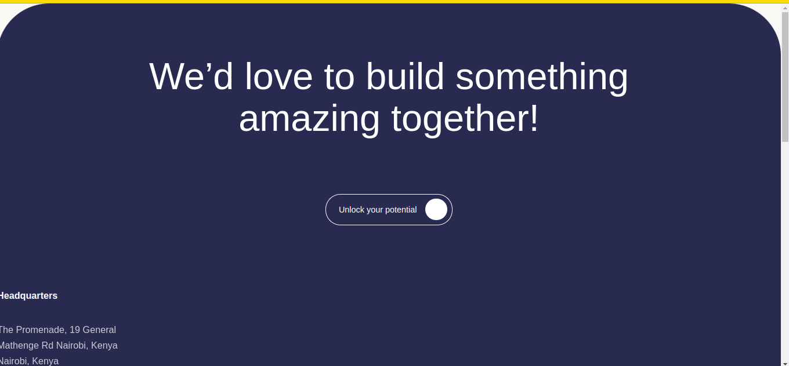

# Website Footer Screenshot



# iTalanta "Discover" Program Contribution Guide

Welcome to the iTalanta "Discover" program! This guide provides students and contributors with essential information and guidelines for making contributions to the iTalanta "Discover" program. In this guide, we'll cover what to expect from the program and provide details on our workflow documentation.

## Table of Contents

- [iTalanta "Discover" Program Contribution Guide](#italanta-discover-program-contribution-guide)
  - [Table of Contents](#table-of-contents)
  - [1. Introduction to iTalanta "Discover" Program](#1-introduction-to-italanta-discover-program)
  - [2. Program Objectives](#2-program-objectives)
  - [3. Getting Started](#3-getting-started)
    - [Prerequisites](#prerequisites)
    - [Setup](#setup)

## 1. Introduction to iTalanta "Discover" Program

The iTalanta "Discover" program is designed to prepare learners for their first job, internship, or apprenticeship In this program, you will work in a simulated work environment, collaborating on open-source software projects. You will be mentored by experienced developers who will act as project managers, answer your questions, review your work, and provide guidance throughout your journey.

## 2. Program Objectives

The primary objectives of the iTalanta "Discover" program include:

- Preparing learners for their first job, internship, or apprenticeship.
- Teaching timeless fundamentals of software development.
- Providing a simulated work environment for practical experience.
- Offering mentorship and guidance by experienced developers.

Please review our [Workflow Documentation](./WORKFLOW-DOCUMENTATION.md) before beginning your contribution.

## 3. Getting Started

To get a local copy up and running, please follow these simple steps.

### Prerequisites

Here is what you need to be able to run the App.

- Node.js
- npm

### Setup

1. Fork then clone repo from your public GitHub repository (fork <https://github.com/italanta/elewa-website-html/fork>).

   ```sh
   git clone https://github.com/{yourusername}/elewa-website-html.git
   ```

2. Go to the project folder

   ```sh
   cd elewa-website-html
   ```

3. Install packages with npm

   ```sh
   npm i
   ```

4. Compile typescript to js and watch for live changes

   ```sh
   npm run watch:ts
   ```

5. Start the dev server.

   ```sh
   npm run serve
   ```
